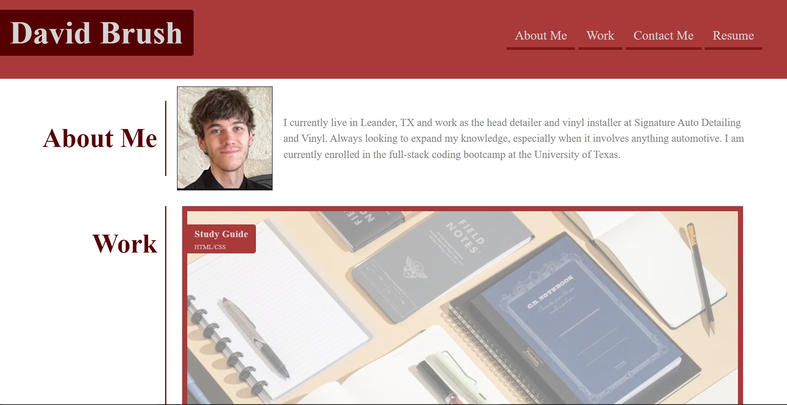
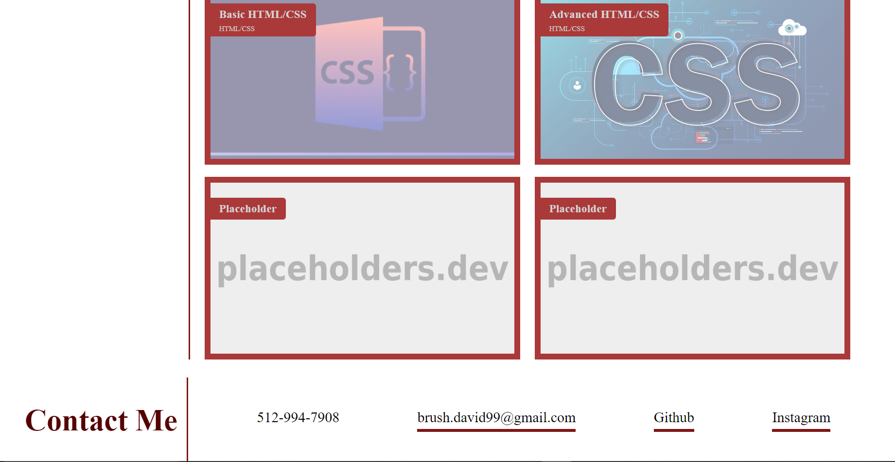

# Personal Portfolio

## Description
This project was to help me further advance my css skills and apply them to a webpage built from scratch. Starting with only a mock-up of how the webpage should look, I was required to build and style the webpage to meet that desired look. I applied the knowledge I learned about flexboxes, positioning, media queries, and pseudocode to achieve the desired outcome that adapts to the size of the viewers' browser.

## Usage
In this webpage, the navigation links at the top of the page take you to that corresponding section of the webpage and the resume link redirects to my resume in google documents. The images in the work section redirect to the live application of those projects in a new tab. The contact me links all redirect to my respective accounts on those websites and the email will open an email window and set my email address as the recipient.

## Screenshots

## Application
The link to the live application of the webpage is: https://coldnebraska.github.io/personal-portfolio/ 

## Source Code
The source code is located at the website https://github.com/coldnebraska/personal-portfolio 

